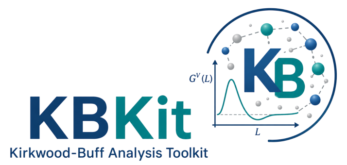
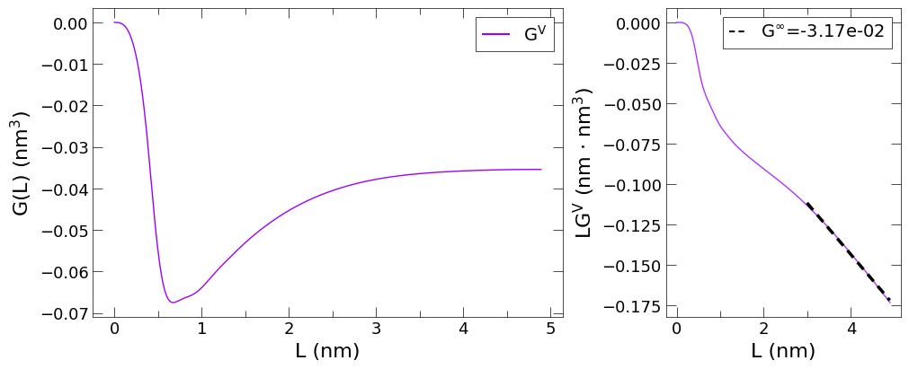
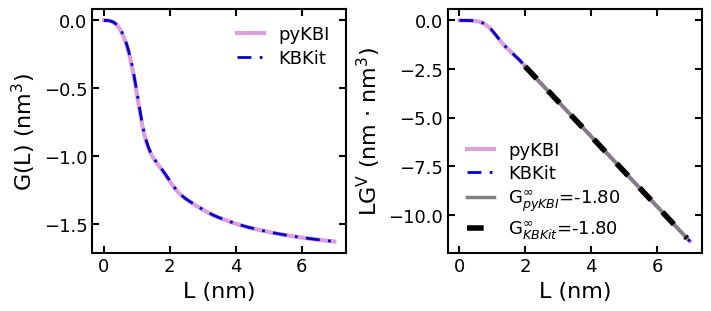

[](https://github.com/anl-sepsci/kbkit/blob/master/LICENSE)
[](https://pypi.org/project/kbkit/)
[](https://pixi.sh)
[](https://github.com/astral-sh/ruff)
[](https://codecov.io/gh/anl-sepsci/kbkit)
[](https://kbkit.readthedocs.io/)


**KBKit** is a Python package for automated Kirkwood-Buff (KB) analysis of molecular simulation data. It provides tools to parse simulation outputs, compute Kirkwood-Buff integrals, and extract thermodynamic properties for binary and multicomponent systems. **KBKit** supports flexible workflows, including:

* Parsing and processing of simulation data (e.g., RDFs, densities)
* Calculation of KB integrals and related thermodynamic quantities
* Integration of activity coefficient derivatives (numerical or polynomial)
* Automated pipelines for batch analysis
* Calculation of static structure factor and X-ray intensities in the limit of q &rarr; 0
* Visualization tools for KB integrals, thermodynamic properties, and static structure factors

**KBKit** is designed for researchers in computational chemistry, soft matter, and statistical mechanics who need robust, reproducible KB analysis from simulation data. The package is modular, extensible, and integrates easily with Jupyter notebooks and Python scripts.

## Installation

### Quick install via PyPI

```python
pip install kbkit
```

### Developer install (recommended for contributors or conda users)

Clone the GitHub repository and use the provided Makefile to set up your development environment:

```python
git clone https://github.com/anl-sepsci/kbkit.git
cd kbkit
make setup-dev
```

This one-liner creates the `kbkit-dev` conda environment, installs `kbkit` in editable mode, and runs the test suite.

To install without running tests:

```python
make dev-install
```

To build and install the package into a clean user environment:

```python
make setup-user
```

For a full list of available commands:

```python
make help
```

## Documentation

Thorough documentation of **KBKit** is located at [https://kbkit.readthedocs.io/en/latest/](https://kbkit.readthedocs.io/en/latest/).

## Examples

Below are several examples on various ways to implement **KBKit**.
See [examples/](https://github.com/anl-sepsci/kbkit/tree/main/examples) for complete tutorials.

### Calculating Kirkwood-Buff integrals on a single RDF

```python
from pathlib import Path
from kbkit.kbi import KBIntegrator
from kbkit.systems import SystemProperties

syspath = Path("./examples/test_data/size_effects/sys_706")
rdf_path = Path(system_path) / "kbi_rdf_files_50ns" / "rdf_ETHOL_ETHOL.xvg"

# create integrator object from single RDF file
integrator = KBIntegrator.from_rdf(
    rdf=rdf_path,
    system_properties=SystemProperties(syspath, start_time=10000),
)

# calculate KBI in thermodynamic limit
kbi = integrator.kbi

# visualize convergence
integ.plot_kbi_compare_extrapolation(integ.weight_type)
```



### Run an automated pipeline for batch analysis

```python
from kbkit.api import Pipeline

# Set up and run the pipeline
pipe = Pipeline(
    pure_path="./test_data/pure_components",  # path to parent directory containing pure-component subdirectories
    pure_systems=["ETHOL_300", "SPCEW_300"],  # pure-component subdirectories
    base_path="./test_data/ethanol_water_26C",  # path to parent directory containing mixture subdirectories
    rdf_dir="kbi_rdf_files",  # name for rdf-file subdirectory in each mixture directory (this needs to be the same in each system.)
    start_time=10000,  # start time (ps) for calculating MD properties (from energy file)
    include_mode="npt",  # string required in MD output files to be a 'valid' filename
    errors="warn",  # prints ConvergenceError & returns NaN for non-converged values
    molecule_map={
        "ETHOL": "ethanol",
        "SPCEW": "water",
    },  # map molecule types in GROMACS files to molecule name for figures
)

# Access the properties in PropertyResults objects
res = pipe.results

# Convert units to kcal/mol
# current units will be read from existing PropertyResult object
g_ex_res = res["g_ex"].to("kcal/mol")

# make figures for KBI analysis and select thermodynamic properties
figpath = Path("./figures/kb_analysis")
figpath.mkdir(exist_ok=True, parents=True)

pipe.make_figures(xmol="ETHOL", savepath=figpath)
```

## Validation

To verify the consistency of the KBI values, this package was validated using the `rdf1.txt` RDF dataset. The results were compared against **kbkit** and **pykbi** to ensure parity.



The figure above demonstrates that our implementation produces results consistent with established benchmarks, ensuring the validity of the calculations.

## File Organization

For running `kbkit.Pipeline` or its dependencies, the following file structure is required: a structured directory layout that separates mixed systems from pure components.
This organization enables automated parsing, reproducible KB integrals, and scalable analysis across chemical systems.

* NOTE: **KBKit** currently only supports parsing for *GROMACS* files.

An example of file structure:

```python
kbi_dir/
├── project/
│   └── system/
│       ├── rdf_dir/
│       │   ├── mol1_mol1.xvg
│       │   ├── mol1_mol2.xvg
│       │   └── mol1_mol2.xvg
│       ├── system_npt.edr
│       ├── system_npt.gro
│       └── system.top
└── pure_components/
    └── molecule1/
        ├── molecule1_npt.edr
        └── molecule1.top
```

**Requirements:**

* Each system to be analyzed must include:
    * rdf_dir/ containing .xvg RDF files for all pairwise interactions
        * Both molecule IDs in RDF calculation *MUST BE* in filename
    * either .top topology file or .gro structure file (.gro is recommended)
    * .edr energy file
* Each pure component must include:
    * either .top topology file or .gro structure file (.gro is recommended)
    * .edr energy file
    * all other files (optional)

## Credits

This package was created with [Cookiecutter](https://github.com/audreyr/cookiecutter) and the [jevandezande/pixi-cookiecutter](https://github.com/jevandezande/pixi-cookiecutter) project template.
